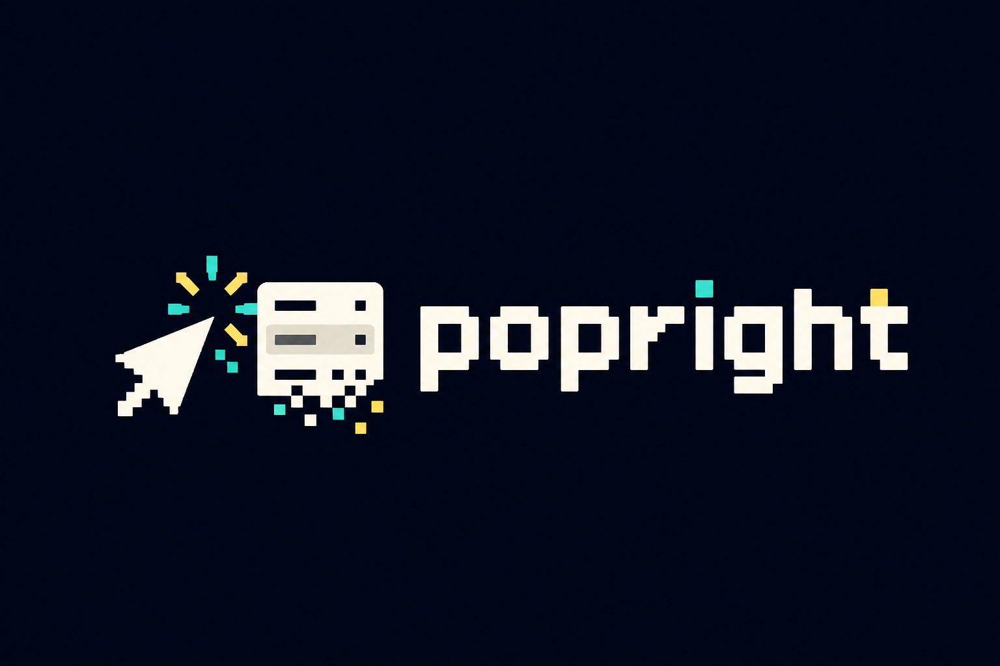

<p align="center">
  
</p>

# Popright

Popright is a tiny, typed, data-driven context menu primitive for modern web apps.

This repository is in early implementation. The current build includes the framework-agnostic core package and a scaffolded React adapter package.

## Packages

- `@popright/core`
- `@popright/react`

## Basic Usage

```ts
import { createContextMenu } from "@popright/core";
import "@popright/core/styles.css";

const menu = createContextMenu(document.querySelector("#file-row")!, {
  items: [
    { id: "open", label: "Open" },
    { id: "rename", label: "Rename", shortcut: "F2" },
    { type: "separator" },
    { id: "delete", label: "Delete", variant: "danger" }
  ],
  onSelect({ id }) {
    console.log(id);
  }
});

menu.destroy();
```

## Scripts

```sh
npm run build
npm run check
npm run test
npm run test:visual
npm run test:visual:update-screenshots
npm run build:demo
npm run serve:demo
```

The built demo is written to `dist-demo/index.html` and should be served at `http://localhost:4173`.

The workspace is intentionally dependency-light while the core API settles.
